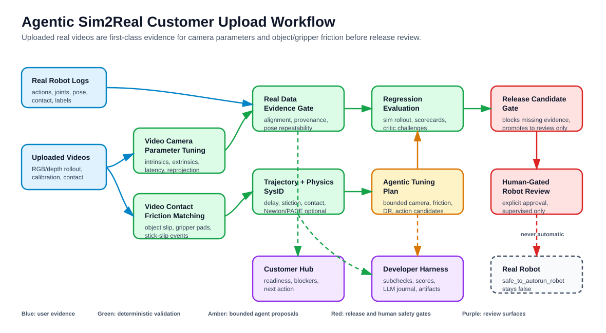
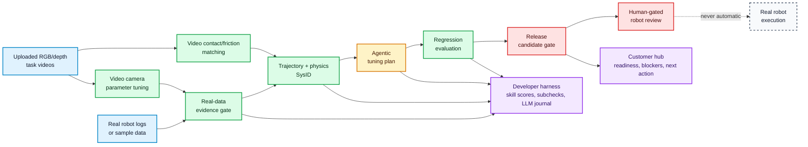

# Agentic Sim2Real

Agentic Sim2Real validates robot logs, proposes bounded sim-to-real updates, and publishes auditable release-readiness hubs.

It is a Python CLI and lightweight framework for robotics teams that need to turn real robot observations into traceable evidence before a policy is promoted toward hardware. The project separates customer-facing readiness review from developer-facing pipeline validation, while keeping the same deterministic gates and human approval boundary underneath.

[](https://github.com/recscores007/agentic_sim2real/actions/workflows/ci.yml)

## Workflow





Customer and developer flows use the same validation pipeline. The difference is presentation:

| Audience | Use when | Primary view |
| --- | --- | --- |
| Customer | A customer or reviewer needs to understand readiness without internal pipeline noise | Workflow status, blockers, evidence summary, recommended next action, hardware approval state |
| Developer | A pipeline author needs to debug or extend the system | Skill manifests, subcheck scores, warnings, release-blocking failures, LLM decisions, raw artifacts |

## Key Features

- Seven consolidated validation skills with explicit manifests, outputs, quality gates, and blocking failures.
- Static customer and developer hubs generated from each run, so evidence can be reviewed without a running web service.
- Scripted or command-backed LLM orchestration that can propose skill order and tuning plans but cannot approve release.
- Real-data readiness checks for trajectory, timing, uploaded video, perception, contact, and policy artifact evidence.
- Uploaded-video evidence hooks for camera-parameter tuning and object/gripper friction matching.
- Physics SysID support with local fallback, video contact/friction evidence, and optional Newton or PACE integrations.
- Release gates that keep real robot motion behind explicit human approval.
- Custom skill overlays for replacing or extending validation behavior without rewriting the harness.

## Demo And Screenshots

Generate a local customer hub:

```bash
./scripts/run_customer_hub.sh
```

Then open:

```text
outputs/customer_hub/ui/index.html
```

For the GitHub front page, add one screenshot or GIF before publishing publicly:

```text
docs/assets/customer-hub.png
docs/assets/developer-harness.gif
```

## Tech Stack

| Area | Tools |
| --- | --- |
| Runtime | Python 3.10+ |
| CLI | `argparse`, installed as `agentic-sim2real` |
| Data contracts | JSON, JSONL, skill manifests |
| UI output | Static HTML, CSS, and JavaScript |
| Tests | `unittest`, GitHub Actions |
| Optional robotics integrations | Isaac Lab, Isaac ROS, Newton, PACE |

The offline harness uses only the Python standard library. Isaac Lab, Isaac ROS, Newton, and PACE are optional external runtimes configured by the user.

## Installation

```bash
git clone https://github.com/recscores007/agentic_sim2real.git
cd agentic_sim2real
python3 -m venv .venv
source .venv/bin/activate
python3 -m pip install --upgrade pip
python3 -m pip install -r requirements.txt
python3 -m pip install -e .
```

Check that the CLI is available:

```bash
agentic-sim2real --help
```

## Quick Start

Run the manifest validator:

```bash
agentic-sim2real --config configs/ur10e_gear_assembly.example.json validate-skills --root .
```

Run the full sample evaluation loop:

```bash
agentic-sim2real --config configs/ur10e_gear_assembly.example.json run-evaluation-loop \
  --root . \
  --dataset sample_data/real_log_demo.jsonl \
  --out outputs/quickstart \
  --audience customer
```

Review the generated hub:

```text
outputs/quickstart/ui/index.html
```

## Usage Examples

Run the customer-facing hub:

```bash
./scripts/run_customer_hub.sh
```

Run the developer-facing harness:

```bash
./scripts/run_developer_harness.sh
```

Run one consolidated validator:

```bash
agentic-sim2real --config configs/ur10e_gear_assembly.example.json run-harness \
  --root . \
  --dataset sample_data/real_log_demo.jsonl \
  --out outputs/one_skill \
  --skill real_data_evidence_gate
```

Run the LLM-orchestrated loop with an initial gap hint:

```bash
agentic-sim2real --config configs/ur10e_gear_assembly.example.json run-llm-loop \
  --root . \
  --dataset sample_data/real_log_demo.jsonl \
  --out outputs/llm_contact_triage \
  --gap-hint contact
```

Prepare a real-data session:

```bash
agentic-sim2real --config configs/ur10e_gear_assembly.example.json prepare-real-data \
  --session embodiments/manipulator/ur10e_gear_assembly/real_data/example_session \
  --root . \
  --out outputs/prepared_real_records.jsonl
```

Run a customer upload session that includes videos:

```bash
./scripts/run_uploaded_session.sh /path/to/customer/session
```

Expected video evidence layout:

```text
/path/to/customer/session/
  video_data/
    index.csv
    analysis.json
    camera_calibration.mp4
    contact_friction.mp4
```

The built-in pipeline validates the video index and analysis contract. For pixel-level video watching, set `video_evidence.analysis_command` to a command that reads `AGENTIC_SIM2REAL_VIDEO_INPUT_JSON` and writes camera/friction metrics to `AGENTIC_SIM2REAL_VIDEO_OUTPUT_JSON`.

Only check the real-robot gate in a supervised hardware session:

```bash
export I_ACCEPT_AGENTIC_SIM2REAL_REAL_ROBOT_RISK=yes
agentic-sim2real --config configs/ur10e_gear_assembly.example.json check-real-gate
```

## Consolidated Skills

| Skill | Purpose |
| --- | --- |
| `project_preflight` | Validate local environment, ROS/Isaac assumptions, task configuration, and policy artifacts. |
| `real_data_evidence_gate` | Check real log quality, alignment, uploaded camera video, pose repeatability, and evidence completeness. |
| `physics_sysid` | Estimate physics gaps from trajectories, contact logs, uploaded friction videos, and optional Newton/PACE backends. |
| `agentic_tuning_plan` | Propose bounded camera, friction, domain-randomization, action-scale, and experiment updates from observed evidence. |
| `regression_evaluation` | Check simulation rollout and regression evidence before release. |
| `release_candidate_gate` | Decide whether the candidate can move to human review. |
| `real_robot_gate` | Require explicit human approval before any hardware-facing action. |

## Configuration

The default example config is:

```text
configs/ur10e_gear_assembly.example.json
```

Important fields:

| Field | What it controls |
| --- | --- |
| `task_spec.mode` | Characterization or policy-release workflow intent. |
| `task_spec.skills_allowed` | Skills available to the orchestrator and harness. |
| `ui.audience` | Default generated hub audience: `customer` or `developer`. |
| `release.profile` | Smoke or stricter release validation expectations. |
| `llm_orchestrator.provider` | `scripted` or command-backed orchestration. |
| `video_evidence.analysis_command` | Optional command that watches uploaded videos and writes camera/friction metrics. |
| `video_evidence.reprojection_error_gate_px` | Gate for camera-calibration video analysis. |
| `video_evidence.min_friction_confidence` | Minimum confidence for video-derived object/gripper friction tuning. |
| `sysid.*` | Newton, PACE, and local SysID settings. |
| `safety.real_robot_gate_env` | Environment variable required for hardware-facing checks. |

Use `configs/*.local.json` for private machine-specific settings. Local config files are ignored by Git.

## Project Structure

```text
agentic_sim2real/      Python package and CLI implementation
skills/                Built-in skill manifests
examples/custom_skills Example external skill override
configs/               Example pipeline configuration
embodiments/           Robot/task-specific real-data scaffolds
sample_data/           Small sample logs for offline runs
golden/                Golden inputs used by regression checks
scripts/               Convenience commands for common workflows
tests/                 Unit and integration-style tests
.github/workflows/     GitHub Actions CI
```

Generated runs go under `outputs/` and are ignored by Git.

## Development

Run the checks used by CI:

```bash
PYTHONPATH=. python3 -m py_compile agentic_sim2real/*.py tests/test_pipeline.py
PYTHONPATH=. python3 -m unittest discover -s tests
PYTHONPATH=. python3 -m agentic_sim2real.cli --config configs/ur10e_gear_assembly.example.json validate-skills --root .
bash -n scripts/*.sh
```

See [CONTRIBUTING.md](CONTRIBUTING.md) for the contribution workflow and pull request checklist.

## Repository Hygiene

- Keep generated runs, logs, rosbags, videos, model checkpoints, and local configs out of Git.
- Use `.gitignore` for ordinary generated files.
- Use Git LFS for required large assets that must be versioned.
- Do not commit credentials, customer logs, private robot calibration, or hardware access tokens.

## Security And Safety

Please do not report vulnerabilities or safety bypasses in public issues. See [SECURITY.md](SECURITY.md) for reporting guidance.

Real robot execution is intentionally human-gated. The LLM and skill harness may propose, validate, and report evidence, but they must not silently approve hardware motion.

## Contributing

Contributions are welcome once the repository owner confirms the intended public collaboration model. Start with [CONTRIBUTING.md](CONTRIBUTING.md) and follow the [CODE_OF_CONDUCT.md](CODE_OF_CONDUCT.md).

## License

No `LICENSE` file is present yet. Recommended options:

- Apache-2.0 if this will be a public robotics/ML project and you want a permissive license with an explicit patent grant.
- MIT if you want a shorter permissive license and do not need the Apache patent language.

Choose a license before accepting external contributions or encouraging customer reuse.

## Roadmap

Suggested next repository-home additions:

- Add a screenshot or short GIF of the customer hub.
- Add a `CHANGELOG.md` once releases begin.
- Add issue templates for bug reports, skill requests, and safety concerns.
- Publish a stricter production config example after release criteria are finalized.
